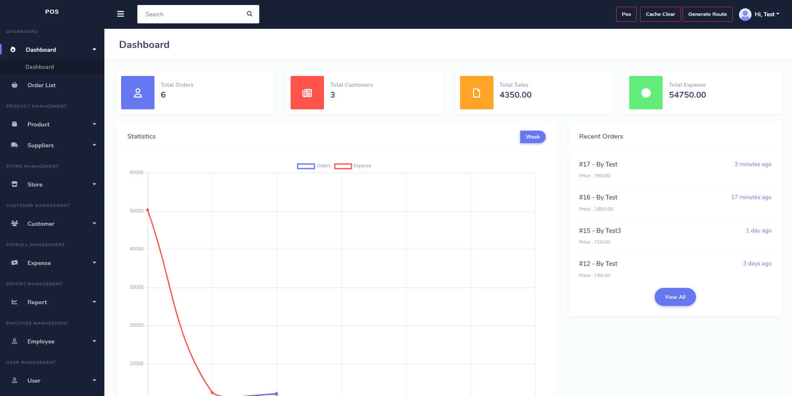

# EPOS 

## Overview

EPOS (Electronic Point of Sale) is a comprehensive solution designed to streamline retail operations. This system provides features for managing sales, inventory, and customer data, facilitating a smooth and efficient checkout process. Built with a focus on usability and performance, EPOS is ideal for businesses looking to modernize their sales operations.



## Features

- **Sales Management:** Process transactions quickly and efficiently.
- **Inventory Control:** Track stock levels, manage reordering, and view inventory reports.
- **Customer Management:** Store and retrieve customer information, track purchase history.
- **Reports:** Generate detailed sales and inventory reports for better decision-making.
- **User Management:** Different access levels for staff and managers.

## Technologies Used

- **Frontend:** HTML,CSS,Bootstrap
- **Backend:** PHP,Laravel
- **Database:** MySQL

## Installation

To get started with EPOS, follow these steps:

1. **Clone the Repository**

   ```bash
   git clone https://github.com/mdashraful305/epos.git
   ```

2. **Navigate to the Project Directory**

   ```bash
   cd epos
   ```

3. **Install Dependencies**

   For the frontend:

   ```bash
   cd frontend
   npm install
   ```

4. **Configure Environment Variables**

   Create a `.env` file in the root directory and add the necessary environment variables:

   ```plaintext
   DB_HOST=your_database_host
   DB_USER=your_database_user
   DB_PASS=your_database_password
   ```

5. **Run the Application**
 
   ```bash
   php artisan serve
   ```

## Usage

1. **Start the Application**

   Launch backend services to start the EPOS system.

2. **Access the Application**

   Open your web browser and go to `http://localhost:8000` (or the port specified in your configuration).

3. **Login**

   Use the credentials set up in the environment variables or default credentials provided.

 4. **Explore Features**

   - **Sales:** Process transactions and view sales reports.
   - **Inventory:** Add, update, and track inventory items.
   - **Customers:** Manage customer profiles and view their purchase history.

## Contributing

We welcome contributions to enhance the EPOS project. To contribute:

    1. Fork the repository.
    2. Create a new branch for your feature or fix.
    3. Commit your changes and push to your fork.
    4. Submit a pull request with a detailed description of your changes.

## License

This project is licensed under the [MIT License](LICENSE).

## Contact

For any questions or feedback, open an issue on the GitHub repository.
